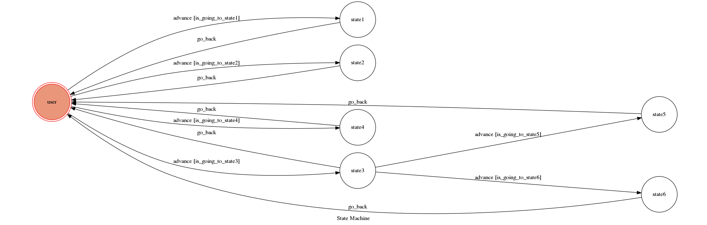
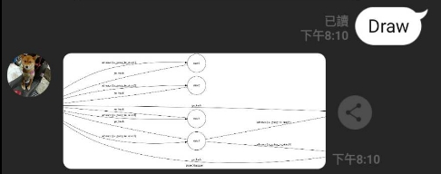
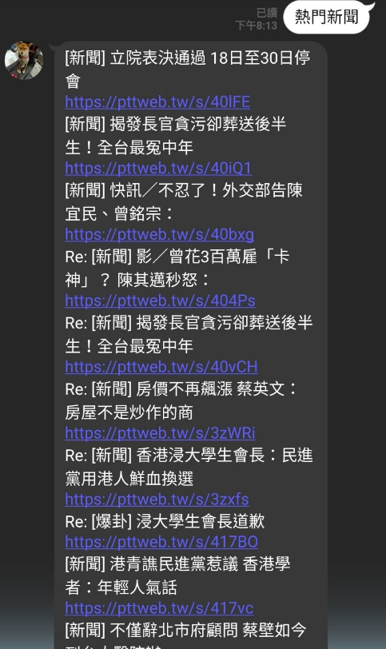
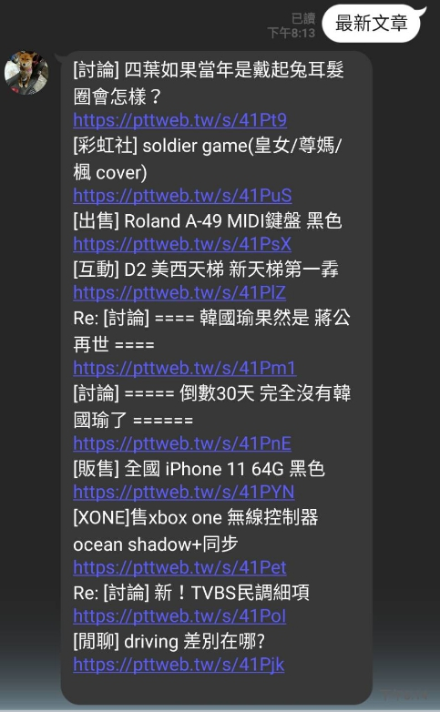

## Line bot --- 批踢踢文章搜尋機器人

### Finite State Machine

下圖為此機器人的FSM圖，後面會依序介紹各個state

傳送"draw"就能讓機器人回傳FSM圖片

## 初步介紹

此line-bot為一個批踢踢文章搜尋的機器人

### 具有以下功能
* 搜尋熱門文章(state1)
* 搜尋熱門新聞(state2)
* 看板功能(state3)
* 最新文章(state4)
* 看板最新文章(state5)
* 看板熱門文章(state6)
* 註：看板功能又細分為看板最新文章和看板熱門文章
 
### 起手

初始位置為User

輸入button後會叫出第一個列表

如下圖

四個選項皆有不同功能

### 熱門文章

顧名思義，就是搜尋批踢踢全站熱門文章，並傳送連結給使用者

實際使用畫面如下

### 熱門新聞

依照批踢踢八卦版的新聞分類，將最多人討論的文章連結傳送給使用者

實際使用畫面如下

### 看板功能

此功能在點選後，會跳出另一個列表如下圖

跳出後可以選擇特定看板，並挑選要最新文章或是熱門文章，同樣會回傳連結給使用者

屬於客制化的功能

實際使用畫面如下，搜尋Beauty板最新文章

### 最新文章

點選後會將批踢踢全站目前最新的數篇文章連結傳送給使用者

實際使用畫面如下，能看見會有多篇文章來自不同的看板

